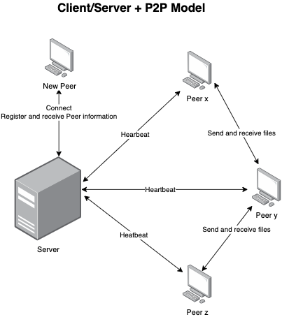
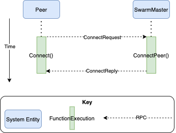
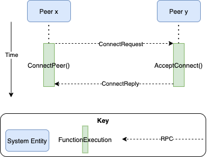
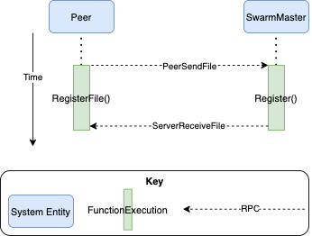
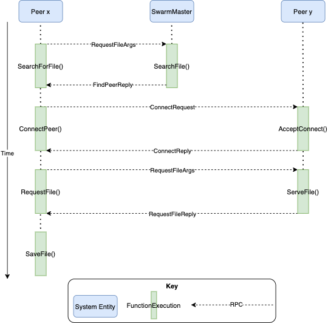

# FileShare
FileShare is an effort to prototype a distributed, peer-to-peer file sharing (or torrenting) network. The Peers are different nodes or users in the network who may wish to share files with one another, while the SwarmMaster acts almost like an indexing server, helping a Peer to join the network and find files on other Peers.  

## Contents
This project was started as a project for CSC-462 (Distributed Systems) at UVIC.  
* `src/`: Contains the code for FileShare, a peer-to-peer distributed file sharing system.
    * `fileshare/`: Contains the Peer and SwarmMaster code, all part of the `fileshare` package.  
    * `labgob/`: Code provided for course labs. Wrapper for the `encoding/gob` package.  
    * `labrpc/`: Code provided for course labs. Simple RPC framework.  
    * `main/`: Contains `main.go` and Peer directories, used for running a test case of the FileShare system.  
* `images/`: Contains architecture related images for the documentation.   

## Peer-to-peer System Architecture
FileShare is a distributed, client/server + peer-to-peer file sharing network (think BitTorrent, Gnutell, or Napster). A high level architecture diagram can be seen below:  

  

## Data flow and Behaviour Diagrams
All components of FileShare (Peers and the SwarmMaster) communicate using Remote Procedure Calls (RPC) over a TCP connection. Below you will find behaviour diagrams for the main functionalities of the system.  

### Peer Connecting to SwarmMaster

### Peer Connecting to Peer

### Registering a File

### Searching for a File

