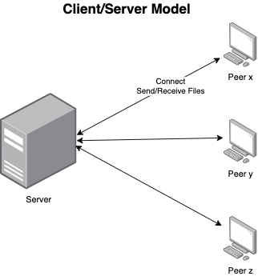
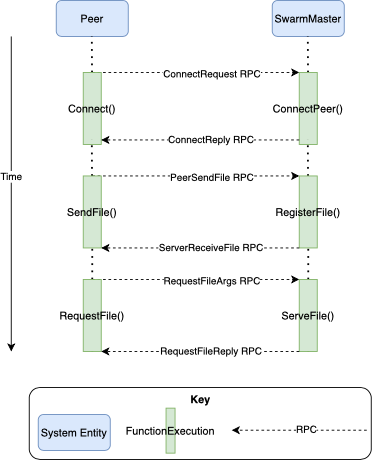

# FileShare
Prototyping a distributed, peer-to-peer file sharing network.

## Contents
This project was started as a project for CSC-462 (Distributed Systems) at UVIC.  
* `src/`: Contains the code for FileShare, a peer-to-peer distributed file sharing system.  

## Client/Server System Architecture
The initial prototype of the system is a client/server architecture in which Peers can send and receive files to/from the Server (SwarmMaster) as demonstrated below:  

  

A typical use case scenario of the client/server FileShare system is demonstrated in the behaviour diagram below:  

  

## Peer-to-peer System Architecture
I am currently working on making FileShare a distributed, peer-to-peer system. Initially, I plan to have it's system architecture similar to what the below diagram represents:  

  

There is more to come for this part of the project!