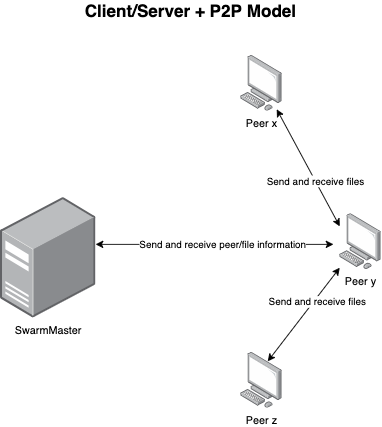
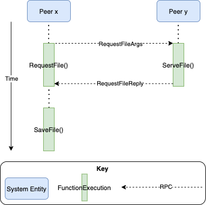

# FileShare
FileShare is an effort to prototype a distributed, peer-to-peer file sharing (or torrenting) network. The Peers are different nodes or users in the network who may wish to share files with one another, while the SwarmMaster acts almost like an indexing server, helping a Peer to join the network and find files on other Peers.  

## Contents
This project was started as a project for CSC-462 (Distributed Systems) at UVIC.  
* `src/`: Contains the code for FileShare, a peer-to-peer distributed file sharing system.
    * `fileshare/`: Contains the Peer and SwarmMaster code, all part of the `fileshare` package.  
    * `labgob/`: Code provided for course labs. Wrapper for the `encoding/gob` package.  
    * `labrpc/`: Code provided for course labs. Simple RPC framework.  
    * `main/`: Contains `main.go` and Peer directories, used for running a test case of the FileShare system.  
* `images/`: Contains architecture related images for the documentation.   

## Peer-to-peer System Architecture
FileShare is a distributed, client/server + peer-to-peer file sharing network (think BitTorrent, Gnutell, or Napster). A high level architecture diagram can be seen below:  

  

## Data flow and Behaviour Diagrams
All components of FileShare (Peers and the SwarmMaster) communicate using Remote Procedure Calls (RPC) over a TCP connection. Below you will find behaviour diagrams for the main functionalities of the system.  

### Peer Connecting to SwarmMaster
A Peer must connect to the SwarmMaster so that it can receive the connection information of the other Peers which may possess the files it wants. It is to be expected that the SwarmMaster’s connection details (e.g. IP, port) are public so that the Peer may connect, whereas the Peer’s connection details are protected (as they are behind NATs) but are obtainable through the SwarmMaster.  

### Peer Connecting to Peer
The process of a Peer connecting to another Peer is nearly identical to the process of a Peer connecting to the SwarmMaster discussed in Section 3.1. The main difference is that the Peer initiating the connection must firstly obtain the connection information of the Peer it would like to connect to. The connecting Peer may obtain this from the SwarmMaster, or via external programming logic.  

### Registering a File
When a Peer registers a file it makes the SwarmMaster aware that it is now making that file public for sharing with other Peers.  

### Requesting a File
A Peer can directly request a file from another Peer if the programming logic using FileShare needs it to do so.  

### Searching for a File
If a Peer would like to download a particular file, but is unaware (or the programming logic using FileShare is unaware) of the whereabouts of the file, it can ask the SwarmMaster to search it’s index for the Peer that has registered the particular file. It will then give the requesting Peer the connection details of the Peer with the file it desires.

